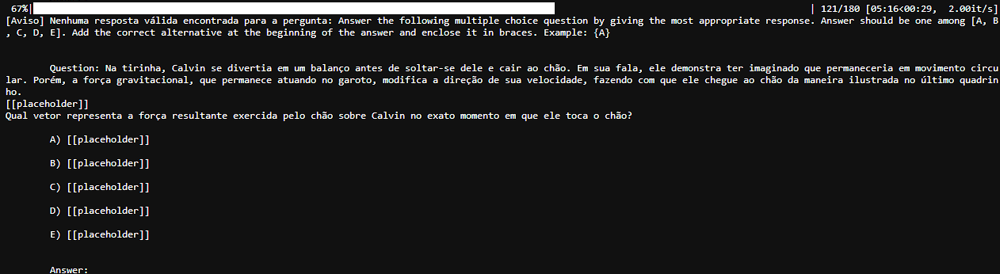
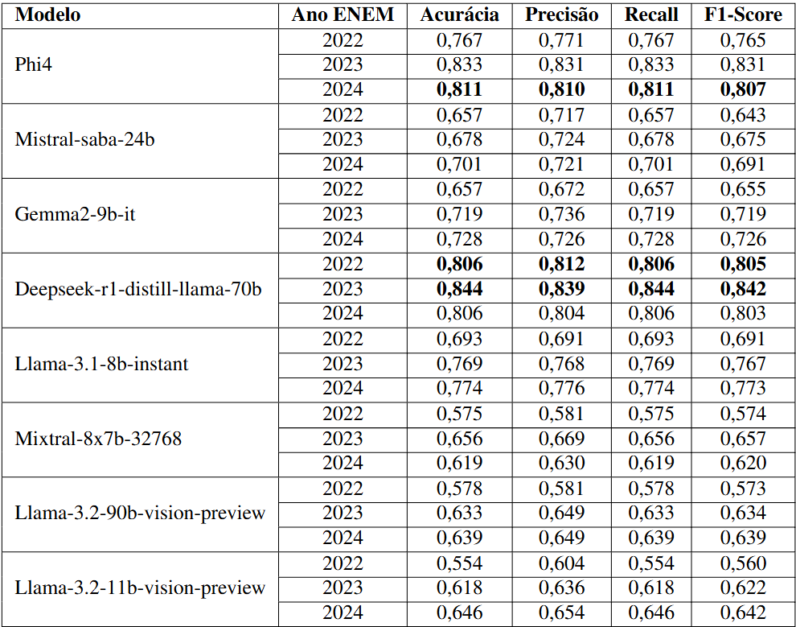

# Ferramenta de avaliação de LLMs

## Descrição

A ferramenta de avaliação de LLMs é uma ferramenta que permite a avaliação de Grandes Modelos de Linguagem (LLMs). Para esse trabalho usamos 3 conjuntos de dados do ENEM dos anos de 2022 a 2024.

## Como rodar o projeto

Para rodar o projeto é necessário instalar as dependências do projeto. Para isso, execute o comando abaixo:
> OBS: É recomendado a utilização de um ambiente virtual para instalar as dependências do projeto.

```bash
pip install -r requirements.txt
```

Após a instalação das dependências, execute o comando abaixo para rodar o projeto:

```bash
python3 main.py --ds_path 2024_images.csv --models "llama-3.1-8b-instant:groq,mixtral-8x7b-32768:groq" --method metrics --max_tokens 10
```

## Parâmetros

- `--ds_path`: Caminho para o arquivo CSV com os dados do dataset.
- `--models`: Modelos que serão avaliados. Os modelos devem ser separados por vírgula.
- `--method`: Método de avaliação. Os métodos disponíveis são: `metrics` e `accuracy`.
- `--max_tokens`: Número máximo de tokens que serão retornados pelo modelo.

## Exemplo de execução

A imagem a seguir mostra um exemplo de execução da ferramenta de avaliação de LLMs.



É possível verificar uma barra de loading e as questões não respondidas no formato adequado pela LLM.

## Resultados

